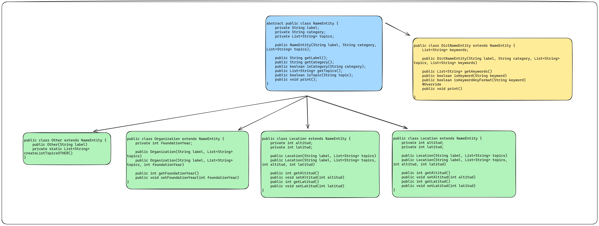

El enunciado del laboratorio se encuentra en [este link](https://docs.google.com/document/d/1wLhuEOjhdLwgZ4rlW0AftgKD4QIPPx37Dzs--P1gIU4/edit#heading=h.xe9t6iq9fo58).

## 1. Tareas

Pueden usar esta checklist para indicar el avance.

### Verificación de que pueden hacer las cosas

- [x] Java 17 instalado. Deben poder compilar con `make` y correr con `make run` para obtener el mensaje de ayuda del programa.

### 1.1. Interfaz de usuario

- [x] Estructurar opciones
- [x] Construir el objeto de clase `Config`

### 1.2. FeedParser

- [x] `class Article`
  - [x] Atributos
  - [x] Constructor
  - [x] Método `print`
  - [x] _Accessors_
- [x] `parseXML`

### 1.3. Entidades nombradas

- [x] Pensar estructura y validarla con el docente
- [x] Implementarla
- [x] Extracción
  - [x] Implementación de heurísticas
- [x] Clasificación
  - [x] Por tópicos
  - [x] Por categorías
- Estadísticas
  - [x] Por tópicos
  - [x] Por categorías
  - [x] Impresión de estadísticas

### 1.4 Limpieza de código

- [x] Pasar un formateador de código
- [x] Revisar TODOs

## 2. Experiencia

Podemos separar en varios puntos la experiencia de hacer el proyecto:

- **Estructurar el código**: La mayor dificultad que tuvimos fue encontrar una manera eficiente y entendible de estructurar código, así como los datos.
- **Manejo de errores**: En esta parte también entendimos la importancia de mantener un código robusto, manejando los distintos tipos de errores.
- **Buenas prácticas de programación en general**: Mantener buenas prácticas de programación en cuanto a: tener buenos nombres para las funciones y variables, modularización para las funciones, el buen uso de comentarios, etc.
- **Entender en profundidad POO**: Entender la diferencias de un lenguaje orientado a objetos en comparación con otros lenguajes.
- Entender niveles de acceso, herencia, tipos de clases (abstractas, publicas, etc).

## 3. Preguntas

### Explicar brevemente la estructura de datos elegida para las entidades nombradas.

- La estructura que elegimos es un objeto que representa una "tupla" de tres parámetros, los cuales son:
- label: es el nombre de la entidad nombrada, que tiene asociada a su vez una clase Person.
- category: representa a la categoría que pertenece la entidad nombrada, que tiene asociada a su vez una clase Category.
- topic: representa a los tópicos que pertenece la entidad nombrada, que tiene asociada a su vez una clase Topics.
  java
- Además esta clase define varios métodos, para trabajar con la misma.



### Explicar brevemente cómo se implementaron las heurísticas de extracción.

- **CapitalizedWordHeuristic**: Es la provista por la cátedra, a partir del texto de entrada hace lo siguiente:

1. Elimina caracteres especiales - + . ^ : , "
2. Normaliza el texto para eliminar acentos y diacríticos
3. Define el patron [A-Z][a-z]+(?:\\s[A-Z][a-z]+)\* que coincidirá con palabras capitalizadas (palabras que empiezan con mayúscula seguidas de minúsculas, posiblemente separadas por espacios)
4. Utiliza el patrón para buscar y extraer coincidencias en el texto y devuelve una lista de palabras o frases capitalizadas encontradas.

- **FilteredCapitalizedWordHeuristic**

1. Elimina caracteres especiales - + . ^ : , "
2. Normaliza el texto para eliminar acentos y diacríticos
3. Define el siguiente patron:

   El patron se divide en dos patrones de la forma `patron1` | `patron2` (| es un or).

   El `patron1` es para identificar una posible entidad nombrada de `una palabra capitalizada`, en cambio el `patron2` para una entidad nombrada de `dos o mas palabras capitalizadas`.

   El `patron1` busca las palabras capitalizadas que no sean palabras como Para, Te, ... que claramente solas no son una entidad nombrada.

   `patron1:`

   ```java
   (?!(\bLes\b|\bLe\b|\bPara\b|\bTe\b|\bYo\b|\bEs\b|\bHay\b|\bSon\b|\bPor\b|\bSera\b|\bAca\b|\bSe\b|\bDe\b|\bEn\b|\bHubo\b|\bA\b|\bSegun\b|\bEsta\b|\bSi\b|\bNo\b|\bCon\b|\bComo\b|\bEllas\b|\bEl\b|\bLa\b|\bLas\b|\bLo\b|\bLos\b|\bUn\b|\bUna\b|\bUnas\b|\bUno\b|\bNosotros\b|\bVosotros\b|\bEllos\b|\bEllas\b|\bUstedes\b|\bMi\b|\bTu\b|\bSu\b|\bMis\b|\bTus\b|\bSus\b|\bNuestro\b|\bNuestros\b|\bNuestra\b|\bNuestras\b))(([A-Z]+[a-z]+)|([A-Z]{2,}[a-z]_))`
   ```

   Mas lindo:
   `(?!(...filtro...))(([A-Z]+[a-z]+)|([A-Z]{2,}[a-z]_))`
   Como podrán notar, se cambio el patron para palabras capitalizadas provista por la cátedra pero su funcionamiento es similar.
   El `patron2` busca posibles entidades nombradas de mas de dos palabras capitalizadas
   `(([A-Z]+[a-z]+)|([A-Z]{2,}[a-z]_))(\s(([A-Z]+[a-z]+)|([A-Z]{2,}[a-z]_)))+`
   Mas lindo:
   `capitalizedWord = (([A-Z]+[a-z]+)|([A-Z]{2,}[a-z]\*))`

   `(capitalizedWord)(\s(capitalizedWord))+`

4. Utiliza el patrón para buscar y extraer coincidencias en el texto y devuelve una lista de palabras o frases capitalizadas encontradas.

- **RestrictedCapitalizedWordHeuristic**

1. Elimina caracteres especiales - + ^ , " (Notar que cambia con respecto a los anteriores)
2. Normaliza el texto para eliminar acentos y diacríticos
3. Define el siguiente patron: <br> (?![:.?!;]\\s*)\\b[A-Z][a-z]+(?:\\s[A-Z][a-z]+)* <br> Notar que [A-Z][a-z]+(?:\\s[A-Z][a-z]+)\* es el patron provisto por la cátedra. <br> <br> El agregado estaría en (?![:.?!;]\\s\*)\\b... . Esto hace que se busquen las palabras capitalizadas pero que no estén luego de : . ? ! ; ya que no podemos saber si la palabra esta en mayúscula por ser una entidad nombrada, en cambio si la palabra esta entre texto, lo mas probable es que si.
4. Utiliza el patrón para buscar y extraer coincidencias en el texto y devuelve una lista de palabras o frases capitalizadas encontradas.

## 4. Extras

Hicimos:

- **Computar estadísticas más interesantes**: Agregamos una nueva que te indica en orden de menor a mayor cuantas veces aparece una entidad nombrada.
